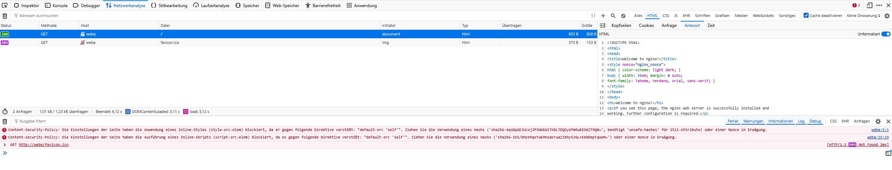

# CSP

## XSS/CSP Demo
Using Demo-App [Addressbook](enable_php.md)

Using Instructions [XSS-Demo](xss_demo.md)

## Preparing Website for exercise
as simple playground...add following code-block to the index.html (or index.nginx-debian.html) before **`</body>`**

```html
<input id="hello_world" type="button" value="Hello World!" />

<script nonce="nginx_nonce">
document.getElementById("hello_world").addEventListener('click', hello);

function hello() {
        alert("hello world!");
}
</script>
```

and add a style tag (within head-section):

```html
<style nonce="nginx_nonce">
  h1 {color:red;}
</style>
```

## CSP general

Set the Content Security Policy. Edit the site configuration.

```nginx
server {
    [...]
    add_header Content-Security-Policy "default-src 'self';" always;    # only resources from our webserver are loaded. Inline script/css tags are blocked as well!
    [...]
}
```

afterwards compare the website to before (comment/uncomment the CSP header).

## CSP nonce
a simple example to generate a dynamic nonce per request...
edit the site configuration.

```nginx
server {
    [...]
    # nonce
    set $nonce $request_id;
    add_header Content-Security-Policy "default-src 'self' 'nonce-$nonce';" always;    # only resources from our webserver are loaded
    sub_filter 'nginx_nonce' "$nonce";
    sub_filter_once off;
    sub_filter_types text/html;
    [...]
}
```

Note: *nginx_nonce* has to match to the value provided in the *script* and *style* tag.

Note2: Test the website again. The style and script tags should now be allowed, as they are whitelisted by using the nonce tag.

## CSP hash
nonce requires will and option to modify the source code of webapp...
another option is using hash-values in the CSP header.

comment the lines from above to have the style and script stop working again.

get hash-values from the debug-console of the browser and add it to the CSP instruction.


```nginx
server {
    [...]
    # csp hash
    add_header Content-Security-Policy "default-src 'self' 'nonce-$nonce' 'sha256-4qxDpGEJUcxjIP3NOEWlTKBLTDQ5y6fmRuEEO6ZT9Q0=' 'sha256-IKS/bMyKMqxTwEMnsaKruaZIbhySJGL+EebDepTqwUM=';" always;    # only resources from our webserver are loaded
    [...]
}
```

Note: Test the website again. The style and script tags should now be allowed, as they are whitelisted by providing their hash-value.

## CSP hash - external ressource

Example Ressource to integrate (can be internal or external hosted !):

```url
https://code.jquery.com/jquery-3.7.1.min.js
```

Note: jquery is (was) a popular library supporting in handling of events, dom-manipulation and request handling.

for external resources, calculate the hash using:

```bash
curl -s https://*domain*/*path-to-resource* | openssl dgst -sha256 -binary | openssl base64 -A
```

integrate the library to your website, by adding following script-tag:

```html
[...]
        <script src="https://code.jquery.com/jquery-3.7.1.min.js"
            integrity="sha256-/JqT3SQfawRcv/BIHPThkBvs0OEvtFFmqPF/lYI/Cxo="
            crossorigin="anonymous">
        </script>
    </body>
</html>
```

Explanation:
 - src: is the URL for fetching the resource
 - integrity: the hash value of resource (to ensure it is exactly the expected resource) -> mandatory when combined with CSP hash
 - crossorigin: explicit usage of CORS. Note: Legacy tags like "script", "img", ... historically do not use CORS, but are limited in usage (e.g. browser blocks full access to resources -> in case of bug, you see script failure but not what exactly). For usage of integrity, CORS is mandatory.

### Verify

refresh your website and use the development console (network analyse) to verify the resource is loaded.

enable CSP:

```nginx
server {
    [...]
    add_header Content-Security-Policy "default-src 'self';" always;    # only resources from our webserver are loaded. Inline script/css tags are blocked as well!
    [...]
}
```

Verify again. The ressource is no longer loaded, as it is blocked by CSP.

### enable external ressources

modify the CSP header:

```nginx
server {
    [...]
    add_header Content-Security-Policy "default-src 'self'; script-src 'self' 'sha256-/JqT3SQfawRcv/BIHPThkBvs0OEvtFFmqPF/lYI/Cxo=';" always;
    [...]
}
```

Verify again. The ressource will now be loaded again as it is whitelisted using its hash-value.